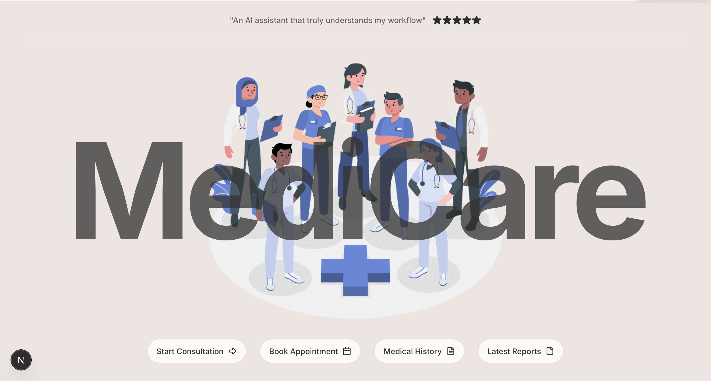

# 🩺 MediAI – Video-Based AI Health Consultation App

**MediAI** is an AI-powered video health consultation platform that helps users identify symptoms in real-time through live video and audio analysis. By combining speech recognition, visual cues, and large language models, MediAI offers early health insights and potential diagnoses — before you even visit a doctor.

---

## 🚀 Project Overview

MediAI is built to simulate a virtual consultation using real-time video + audio. It captures and analyzes user speech and facial/body visuals, extracting symptoms and offering basic health assessments powered by AI.

This project is being developed in **three major phases**:

---

## ✅ v0 – Minimum Viable Features

- 🎙️ **Speech Recognition:** Uses Whisper AI or Deepgram to transcribe user speech describing symptoms.
- 🎥 **Visual Frame Analysis:** Captures frames from live WebRTC video feed and sends them to **GPT-4V** for visual symptom detection (e.g., rashes, eye swelling, fatigue).
- 🧠 **Symptom-to-Disease Mapping:** Uses a custom LLM prompt to interpret symptoms and suggest potential health concerns.
- 💬 **Basic Text-Based Feedback:** Displays a plain-language summary of detected symptoms and possible next steps.

---

## 🎨 v1 – UI/UX Enhancements

- 🖥️ **Live Annotated Video Feed:** Display overlay boxes and tags on detected symptoms.
- 🚦 **Severity Indicators:** Color-coded labels (green/yellow/red) based on LLM confidence.
- 🧠 **Confidence Mechanism:** ReAct-style prompt engineering ensures diagnosis suggestions only appear when enough context has been gathered.
- 📄 **Exportable Reports:** Users can export PDF summaries of the consultation, including text, screenshots, and symptom tags.

---

## 🚀 v2 – Advanced Functionalities

- 📂 **Upload Medical History:** Use RAG (Retrieval-Augmented Generation) to let users upload files that influence the LLM's responses.
- 🧾 **Medical-Grade Reports:** Detailed symptom labeling, timestamped frames, and optional video snippet export.
- 👩‍⚕️ **Patient-Doctor Matching:** Automatically match patients with available nurses/doctors based on symptoms and location.
- 📤 **Send Summary to Provider:** One-click option to email or share the session summary with a verified medical professional.

---

## 🧰 Tech Stack

### 🧑‍💻 Frontend
- **Next.js** + **React** + **Bun/npm**
- **Tailwind CSS** + **Radix UI / ShadCN UI / Magic UI / Kokonut UI**
- **Redos** – type-safe form validation and route handling

### ⚙️ Backend
- **Python** – FastAPI + Uvicorn
- **LLM Providers** – OpenAI GPT-4 / GPT-4V, Google Gemini, Claude, Groq
- **LangChain** – for chaining prompts and integrating tools
- **WebRTC** – for live video (via LiveKit or Daily.co)
- **Whisper AI** – for speech-to-text transcription
